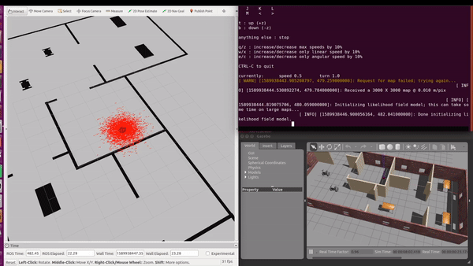

# robotics-software-ND

This repository contains my implementation of selected projects for Udacity's Robotic Software Engineer Nanodegree Program.

## Project 1: Build a Gazebo World

This project builds a gazebo world, including elements of robot, world environment and other static object.

## Project 2: Go Chase It!

A two wheeled robot is programmed to chase a white ball in gazebo. Velocity commands are sent to the robot based on the location of the white ball in the robot's camera frame.

## Project 3: Where Am I?

In this project, the Adaptive Monte Carlo Localization algorithm is used to localize the robot within the simulated environment. Distance from the walls is provided using lidar scans.

## Project 4: Map My World

In this project, RTAB-Map is deployed to map the surrounding environment.

## Project 5: Home Service Robot

In this project, The Turtlebot is programmed to autonomously map the environment and navigate to pickup and deliver virtual objects. 

